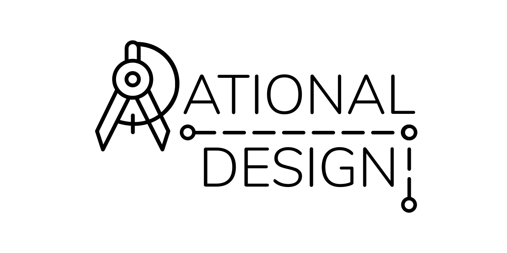

<h1 align="center">

</h1>

<div align="center">
  
</div>

<div align="center">
  <strong>A type scale generator</strong>
</div>

<p align="center">
  <sub>Built with ❤︎ by
  <a href="https://timmybytes.com">Timothy Merritt</a>
</div>

Rational Design is a tool for generating type-scales for use in design systems or web design projects. It’s built with React Hooks, SCSS, Webpack, and npm scripts, and is fully responsive.

## About

Rational Design uses a combination of state and useRef Hooks to dynamically render type scales according to user input. This originally created some delays in state updating properly due to [stale closures](#), but useRef solves this issue by returning the same `ref` value in memory during each rerender.

## Usage

You can use the app from the browser live here, or to run and configure locally, follow these steps:

### Fork and Clone Repo

Fork and clone the repo to your local machine:

```sh
git clone https://github.com/timmybytes/rational-design.git
```

`cd` into the repo, and install dependencies:

```sh
cd rational-design/
npm install
```

### Development

To start a development environment:

```sh
npm start
```

## Contributing

Feel free to submit a pull request if you want to add features or changes, though I would caution this app is still in early stages and I plan to greatly expand its current feature set.

## License

Rational Design is available under the [MIT license](./LICENSE.md).
