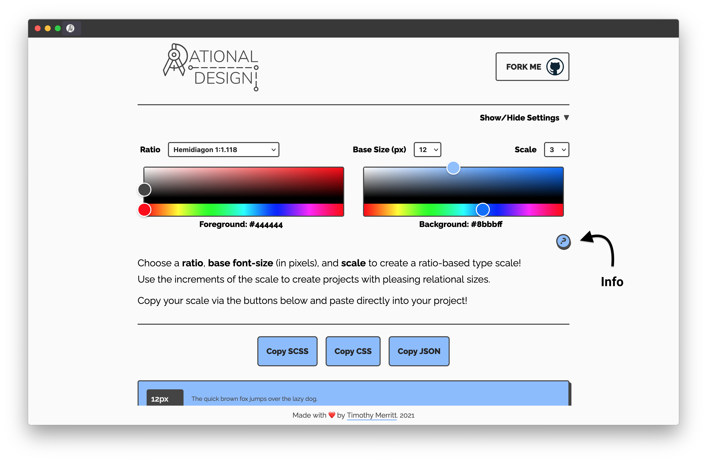
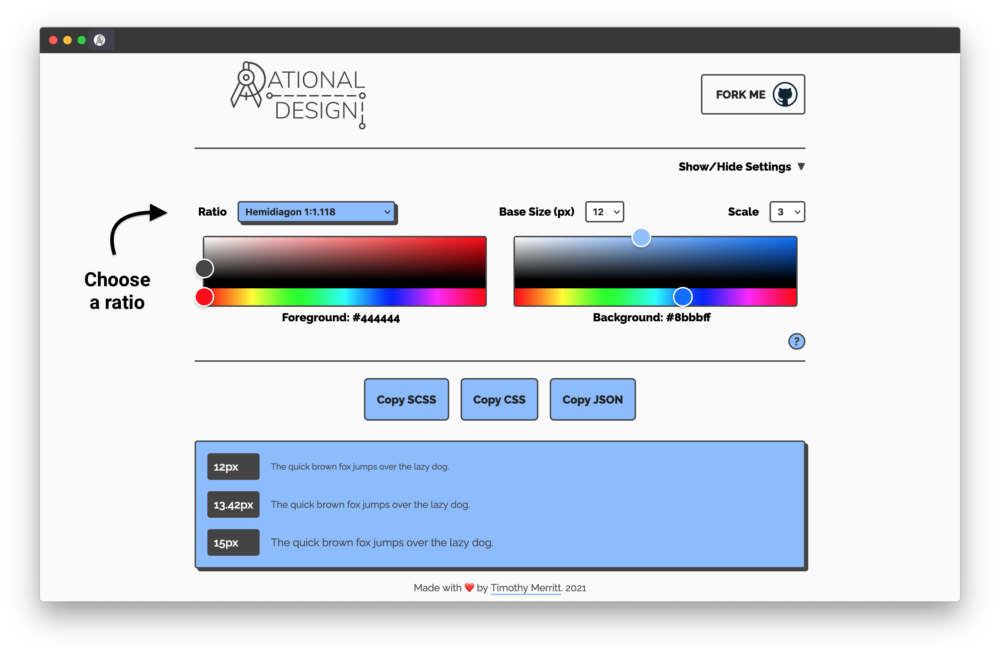
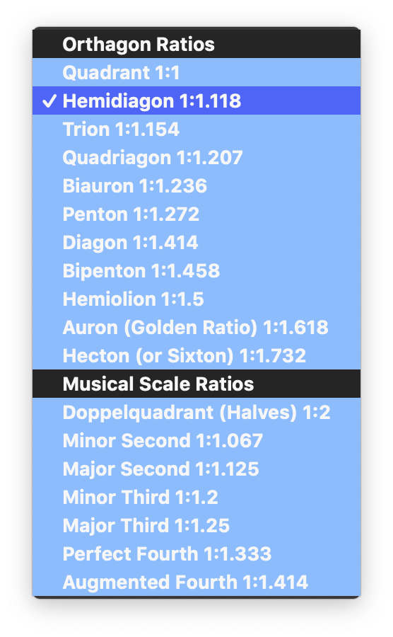
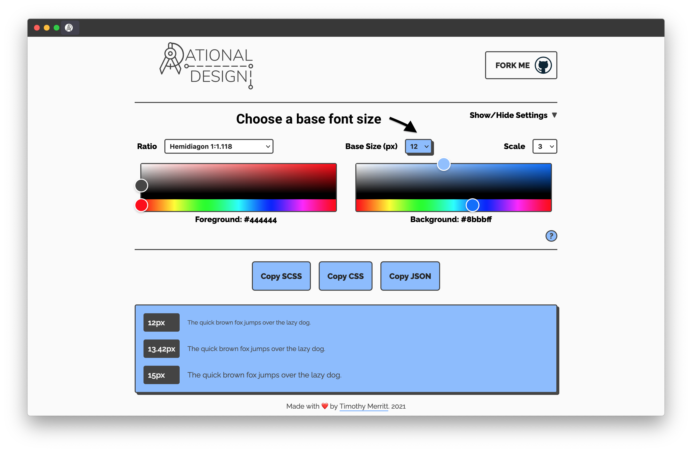
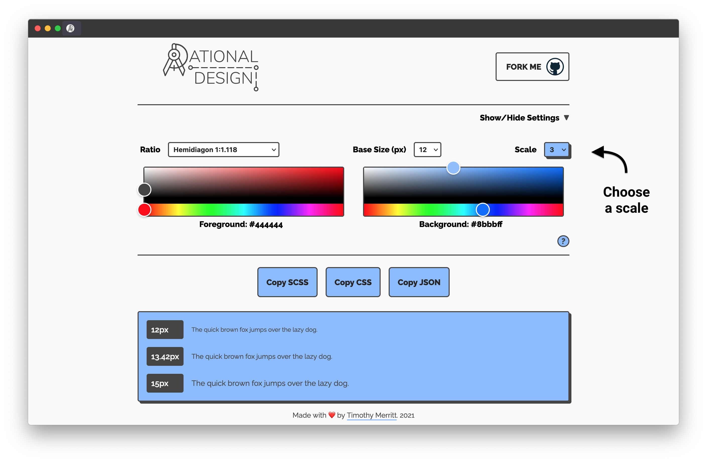
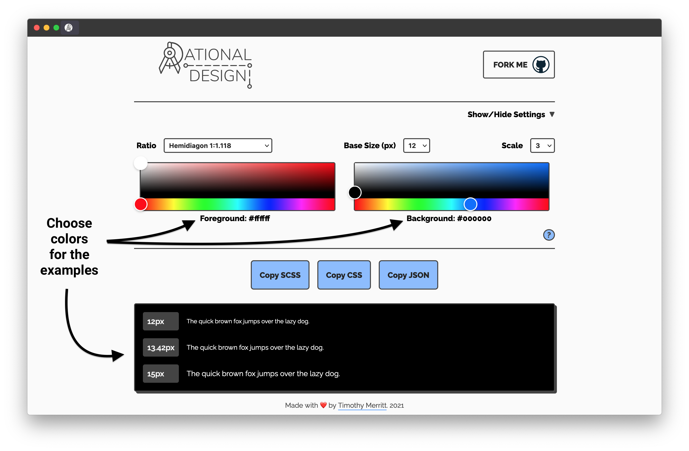

<h1 align="center">

</h1>

<!-- Badges -->
<div align="center">
  
  
  
  
  
  
</div>

<div align="center">
  <strong>A tool for ratio-based design</strong>
</div>

<p align="center">
  <sub>Built with ❤︎ by
  <a href="https://timmybytes.com">Timothy Merritt</a>
</div>

Rational Design is a tool for generating type-scales for greater consistency in
design systems or web design projects. It’s built with React Hooks, SCSS,
Webpack, and npm scripts, and is fully responsive.

## About

Design systems often use a set mathematical ratio in how elements of different
sizes relate to one another, particularly with the use of type. Rational Design
let's you demo various type scales based on classical geometric and musical
ratios. These scales can then be applied to your own projects via a CSS, SCSS,
or JSON copy-to-clipboard function, ensuring your project has an underlying
guide for scaling consistency.

## Usage

### Web App

Use the [live web app](https://timmybytes.github.io/rational-design/) to create
a ratio-based type scale. You can click the **info button** in the app for more
details. Play around with the settings to generate different scales.

<!--  -->

#### Select a ratio

Choose a ratio from the dropdown menu to define the increments of your scale.
The ratios included come from musical-based ratios, as well as Orthagon ratios.
You can
[read more about using ratios in your layouts and designs here](https://alistapart.com/article/content-out-layout/).

<!--  -->
<!--  -->

#### Choose a base size

Choose a base font size (in pixels). The rest of your scale will be calculated
starting from this number by applying your chosen ratio to each increment.

<!--  -->

#### Choose a scale

The **scale** determines how many ratio increments the app should output. The
default is 3, but you can go up to 99.

<!--  -->

#### Chose colors

A color chooser is incorporated into Rational Design's settings via
[react-color](https://casesandberg.github.io/react-color/#examples). Use the
color pairings to see your type scale in different color contrasts.

<!--  -->

#### Copy your type scale

The settings you create can be copied as SCSS, CSS, or JSON data, and pasted
right into your project. You can use the resulting increments as a system for
consistency in your projects. Instead of just eyeballing bigger and smaller
sizes, choose from your scale and your designs will be more pleasing to the eye
(and easier to manage).

<!--  -->

---

### Local Development

To run and configure locally, follow these steps:

#### Fork and Clone Repo

Fork and clone the repo to your local machine:

```sh
git clone https://github.com/timmybytes/rational-design.git
```

`cd` into the repo, and install dependencies:

```sh
cd rational-design/
npm install
```

#### Development

To start a development environment:

```sh
npm start
```

## Contributing

Feel free to submit a pull request if you want to add features or changes,
though I would caution this app is still in early stages and I plan to greatly
expand its current feature set.

## License

Rational Design is available under the [MIT license](./LICENSE.md).
